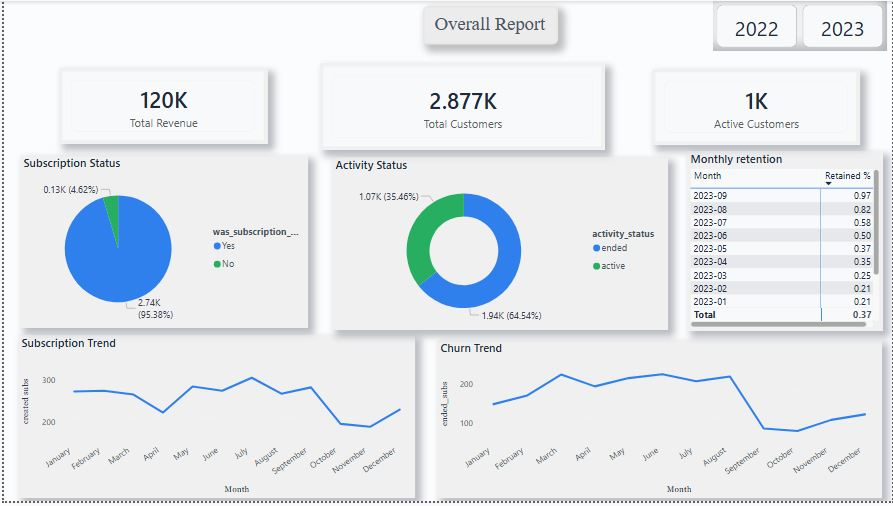

# 📊 Subscription Analysis Dashboard

## 📌 Project Overview
This project focuses on analyzing a subscription-based business dataset to understand customer behavior, revenue trends, and churn patterns over time.  
The dashboard provides a clear view of key metrics and highlights critical periods of growth and churn.

---

## 🛠 Tools & Technologies
- Power BI  
- Power Query  
- DAX  
- Excel (CSV Dataset)  

---

## 📊 Key KPIs
- Total Revenue  
- Active Customers  
- Subscription Status  
- Activity Status  
- Subscription Trends  
- Churn Trends  

---

## 📈 Key Insights
- A noticeable increase in both **subscriptions and churn** occurs between **March and September**, indicating a high user activity period.  
- Subscriptions show a **consistent growth trend from 2022 to 2023**.  
- The number of **active customers has steadily increased over time**.  
- Revenue experienced a **significant increase (approximately 3x growth)** during the observed period.  

---

## 💡 Business Recommendations
- The March–September period attracts high user engagement but also shows increased churn.  
- Implementing **targeted retention strategies** such as personalized offers, discounts, or engagement campaigns during this period can help reduce churn while maintaining growth.  

---

## 🖼 Dashboard Preview

 
